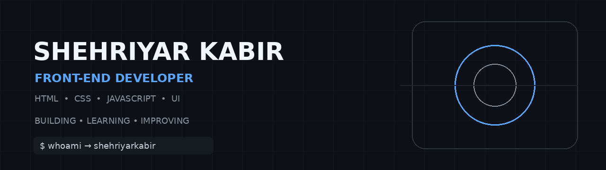

<div align="center">



<br>

# 👋 Hey, I'm Shehriyar Kabir

### `Front-End Developer` · `JavaScript Learner` · `Builder`

<p>
  <a href="https://github.com/ShehriyarKabir">
    
  </a>
  
  
</p>

</div>

---

## `> whoami`

I'm a **front-end web developer from Pakistan 🇵🇰** who enjoys turning ideas into clean, responsive, accessible, and user-friendly websites.

I've completed the **freeCodeCamp Responsive Web Design certification** and I'm currently diving deeper into **JavaScript**.

My goal is simple:

> **Learn the fundamentals → build real projects → keep improving.**

---

## 🧑‍💻 About Me

```js
const shehriyar = {
    role: "Front-End Developer",
    location: "Pakistan 🇵🇰",

    skills: [
        "HTML5",
        "CSS3",
        "Responsive Design",
        "JavaScript"
    ],

    tools: [
        "Git",
        "GitHub",
        "VS Code"
    ],

    currentlyLearning: "JavaScript",

    interests: [
        "Web Development",
        "UI / UX",
        "Clean Code",
        "Problem Solving"
    ],

    mindset: "Build. Learn. Improve. Repeat."
};
```

---

## ⚡ Tech Stack

### Front-End

<p>
  
</p>

### Tools

<p>
  
</p>

---

## 🚀 Currently

```text
┌──────────────────────────────────────────────┐
│                                              │
│  📚 Learning JavaScript                      │
│  🛠️ Building practical projects              │
│  🎨 Improving UI & responsive design         │
│  🧠 Strengthening problem-solving            │
│  🌱 Growing my developer portfolio           │
│                                              │
└──────────────────────────────────────────────┘
```

---

## 🏆 Certification

### Responsive Web Design

**freeCodeCamp**

Completed the Responsive Web Design certification covering:

`HTML` · `CSS` · `Accessibility` · `Flexbox` · `Grid` · `Responsive Design` · `Animations`

<a href="https://www.freecodecamp.org/certification/shehriyarkabir/responsive-web-design-v9">
  
</a>

---

## 🛠️ Featured Projects

### 🎨 Blog Preview Card

A responsive blog preview card built as a Frontend Mentor challenge.

**Built with:** `HTML` · `CSS` · `Responsive Design`

<a href="https://github.com/ShehriyarKabir/Blog-card-preview">
  
</a>

---

### 🔳 QR Code Component

A clean and responsive QR code component built while practicing modern CSS layout techniques.

**Built with:** `HTML` · `CSS` · `Responsive Design`

<a href="https://github.com/ShehriyarKabir">
  
</a>

---

## 📈 My Learning Journey

```text
HTML
 │
 ▼
CSS
 │
 ▼
Responsive Web Design  ✓
 │
 ▼
JavaScript  ← CURRENT
 │
 ▼
Modern Front-End Development
 │
 ▼
Real-World Projects
 │
 ▼
AI + Web Development
```

---

## 🎯 What I'm Working Toward

I want to become a **strong, practical front-end developer** who understands the fundamentals instead of simply relying on frameworks and tools.

I'm focusing on:

* Writing clean and maintainable code
* Understanding JavaScript deeply
* Building responsive interfaces from scratch
* Improving accessibility
* Solving problems independently
* Turning what I learn into real projects

---

## 🌐 Find Me

<p>
  <a href="https://github.com/ShehriyarKabir">
    
  </a>
</p>

---

<div align="center">

### `BUILD • LEARN • IMPROVE`

⭐ Thanks for stopping by.

**Feel free to explore my repositories and follow the journey.**

</div>
